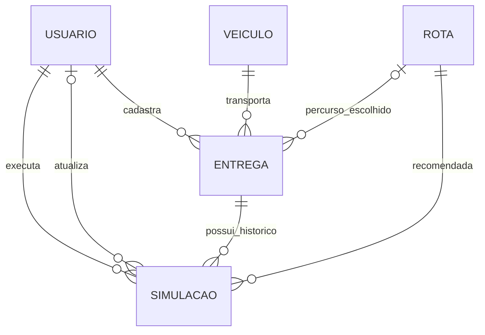

# Modelo conceitual

Cinco entidades mantêm o escopo essencial. A autoria e a associação entre entrega, veículo e rota permitem explicar a operação inteira.

| Entidade  | Significado                                                                                        |
| --------- | -------------------------------------------------------------------------------------------------- |
| Usuário   | Pessoa autenticada com perfil administrador ou operador.                                           |
| Veículo   | Meio de transporte com placa, capacidade e estado disponível/manutenção.                           |
| Rota      | Alternativa de percurso com origem, destino, distância estimada e pontos de visualização.          |
| Entrega   | Operação com carga, prazo, agendamento, veículo, autor e estado. Pode aguardar a escolha da rota.  |
| Simulação | Previsão persistida de uma entrega em um cenário, com rota recomendada e retrato das alternativas. |

Um veículo pode atender várias entregas ao longo do tempo, mas somente uma em andamento. Uma entrega tem um veículo e um autor; a rota é opcional enquanto pendente e obrigatória ao iniciar. Cada simulação pertence a uma entrega, tem uma rota recomendada e um autor. O responsável pela atualização é opcional antes da primeira edição. Os mesmos usuários podem realizar várias operações.

O mapa e os indicadores são visualizações dessas entidades; não criam tabelas adicionais. Agenda é a consulta por data de agendamento. As velocidades dos dois cenários são regras fixas do serviço.
